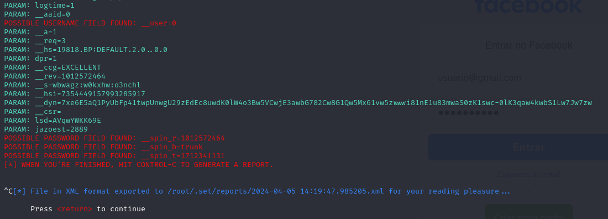

# Phishing para captura de senhas do Facebook

### Ferramentas

- Kali Linux
- setoolkit

### Configurando o Phishing no Kali Linux

- Acesso root: ``` sudo su ```
- Iniciando o setoolkit: ``` setoolkit ```
- Tipo de ataque: ``` Social-Engineering Attacks ```
- Vetor de ataque: ``` Web Site Attack Vectors ```
- Método de ataque: ```Credential Harvester Attack Method ```
- Método de ataque: ``` Site Cloner ```
- Obtendo o endereço da máquina: ``` ifconfig ```
- URL para clone: http://www.facebook.com

### Resutados


## Observações:

- A ferramenta só está funcionando quando abrimos o site clonado no navegador Internet Explorer.
- Em alguns casos, a senha capturada não é exibida na tela, mas é salva no arquivo de report que é criado quando digitamos Ctrl+C para interromper o servidor, conforme mostrado na figura abaixo:


Neste caso a senha não foi mostrada, mas está gravada no arquivo /root/.set/reports/2024-04-05 14:19:47.985205.xml
